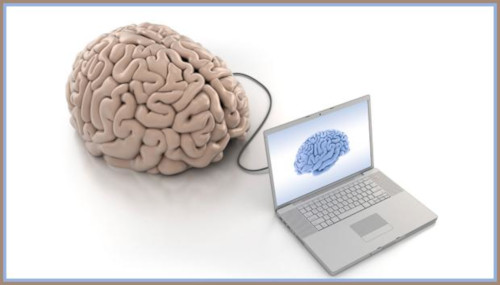

# Komunikacja Człowiek-Komputer

(Human-Computer Interaction)

Przedmiot prowadzony jest dla studentów 2-ego roku kierunku kognitywistyka na Uniwersytecie Adama Mickiewicza w Poznaniu.

Polecamy podgląd tego repozytorium w Jupyter nbviewer pod [tym](https://nbviewer.jupyter.org/github/mikbuch/hci/tree/master/) adresem.

### Kontakt do prowadzących

 * dr inż Marcin Jukiewicz (koordynator) marcin.jukiewicz[at]amu.edu.pl
 * mgr Dawid Ratajczyk, dawid.ratajczyk[at]amu.edu.pl
 * mgr Mikołaj Buchwald, mikolaj.buchwald[at]amu.edu.pl

### Z czego składa się kurs?

Kurs składa się z dwóch zasadniczych części:
 1. Web development (podstawy rozwoju oprogramowania)
 2. Analiza sygnału

Podczas realizacji każdej części wykonujemy projekt w grupach dwuosobowych. Oceny wystawiane są indywidualnie.

Ocena końcowa jest wypadkową dwóch ocen z projektów.

### Kryteria oceny projektów

Skala ocen z projektów: 2.0, 3.0, 3.5, 4.0, 4.5, 5.0

Wymagania ogólne:
 * projekt znajduje się na GitHubie,
 * raport zgodny z wytycznymi przekazanymi na wykładzie.

Wymagania odnośnie raportów:
 * brak strony tytułowej: dwie oceny w dół,
 * strona tytułowa niezgodna z wytycznymi: ocena w dół,
 * brak podpisów pod grafikami: ocena w dół,
 * brak opisów nad tabelami: ocena w dół,
 * brak opisów osi na wykresie: ocena w dół,
 * brak bibliografii/źródeł: dwie oceny w dół,
 * bibliografia/źródła niezgodne z wytycznymi: ocena w dół.

**Uwaga**: Zgodnie z regulaminem studiów obowiązują dwie obecności, niezależnie od tego, czy są one usprawiedliwione, czy nie.

#### Informacje dodatkowe

Warto wiedzieć: jeśli nowe zmiany zostaną wypchnięte na GitHub, nbviewer odświeży się automatycznie dopiero po około 10-ciu minutach. Można wymusić to odświeżenie dodając na końcu adresu: `?flush_cache=true`
